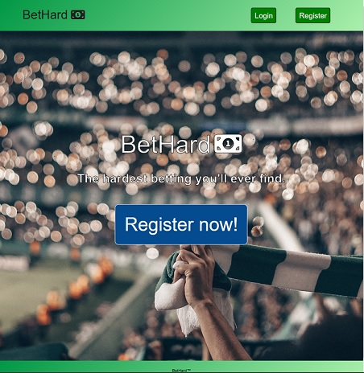
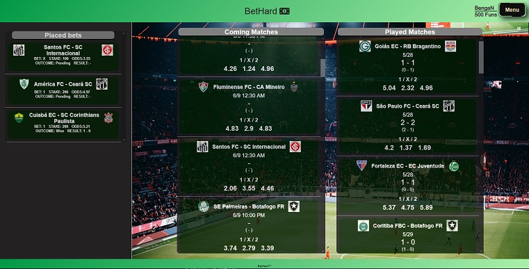
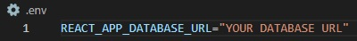

## BetHard Frontend
> A project for a web applications course at NBI/Handelsakademin

---

---

This project uses:
* ReactJS
* Axios

### To run
Clone project, run npm install in frontend folder (bethard-frontend), and set up your .env-file like this:

