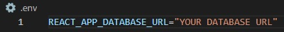

# BetHard Fullstack Project
> Made by: Daniel Frones, Emil Wallin, & Patrick Snäll

## About
```This project is part of a web applications course at NBI/Handelsakademin```

The project uses an external API combined with a database to provide matches for "dream betting". Only league supported is the Brazilian Serie A.

The website frontend allows users to register, login, place bets on upcoming matches, and see previous matches' results.

---


## This project uses:
### Database and Backend:


* SQL Server (MSSQL)
* .Net Framework 5
* Entity Framework Core
* [football-data API by Daniel Freitag ](https://www.football-data.org/about)
* Database was originally hosted on Azure. Server hosting is not provided.

### Frontend


* ReactJS
* Axios
---
## To run:
#### Backend
* An SQL Server is needed for you to run this application.
>
* Configure your Appsettings.json:


>
* And your .env file (backend):

>
* Run the command "update-database" to allow EFCore to create the database on your server.
>
* Start the server.

### Frontend
* Simply configure your env file as such:

>
* Run "npm install" in console to install modules
>
* Start your webserver with "npm start"
